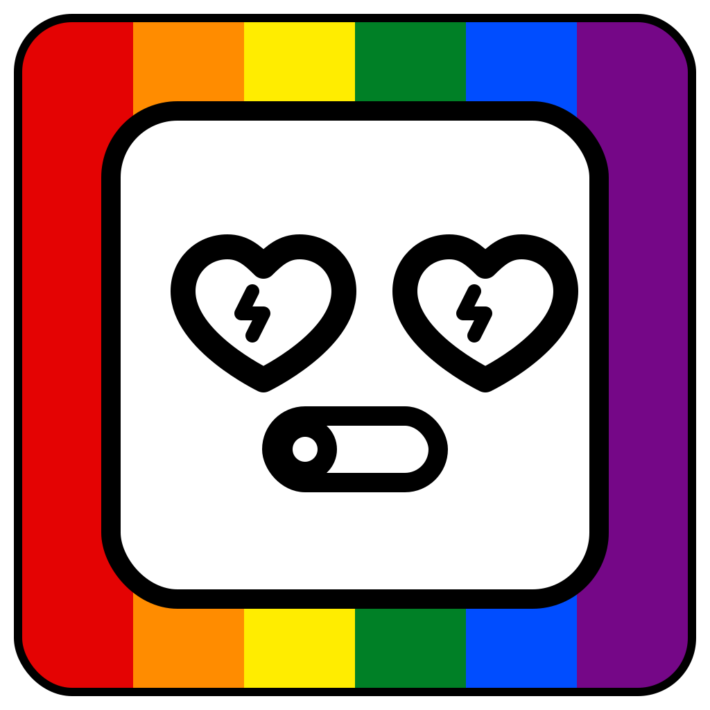

<div>
  
  <div>
    <h1>Pistorasia</h1>
    <p>A simple GUI and CLI application for controlling SiS-PM USB power strips (EnerGenie EG-PMS and compatible devices).</p>
  </div>
  <div style="clear: both;"></div>
</div>

## Features

- **GUI Mode**: User-friendly PySide6 interface with:
  - Visual power outlet controls
  - Custom naming for devices and outlets
  - Multi-device support with tabbed interface
  - Persistent configuration storage

- **CLI Mode**: Command-line control for automation and scripting:
  - List all connected devices
  - Control outlets by number or custom name
  - Toggle, turn on/off individual or multiple outlets
  - Status queries

## Requirements

- Python 3
- PySide6
- pyusb
- USB access permissions (see Setup)

## Installation

1. Clone the repository
2. Install dependencies:
   ```bash
   pip install -r requirements.txt
   ```

## Setup

To allow non-root users to access the USB devices, create a udev rule:

```bash
sudo nano /etc/udev/rules.d/60-sispmctl.rules
```

Add the following content:

```
SUBSYSTEM=="usb", ATTR{idVendor}=="04b4", ATTR{idProduct}=="fd10", GROUP="sispmctl", MODE="660"
SUBSYSTEM=="usb", ATTR{idVendor}=="04b4", ATTR{idProduct}=="fd11", GROUP="sispmctl", MODE="660"
SUBSYSTEM=="usb", ATTR{idVendor}=="04b4", ATTR{idProduct}=="fd12", GROUP="sispmctl", MODE="660"
SUBSYSTEM=="usb", ATTR{idVendor}=="04b4", ATTR{idProduct}=="fd13", GROUP="sispmctl", MODE="660"
SUBSYSTEM=="usb", ATTR{idVendor}=="04b4", ATTR{idProduct}=="fd15", GROUP="sispmctl", MODE="660"
```

Then reload udev rules and add your user to the group:

```bash
sudo udevadm control --reload-rules
sudo groupadd sispmctl
sudo usermod -a -G sispmctl $USER
```

Log out and back in for the group changes to take effect.

## Usage

### GUI Mode

Simply run the application:

```bash
./pistorasia.py
```

### CLI Mode

List all devices and outlets:
```bash
./pistorasia.py --cli --list
```

Turn on an outlet:
```bash
./pistorasia.py --cli --device 0 --outlet 1 --on
```

Turn off an outlet:
```bash
./pistorasia.py --cli --device 0 --outlet 1 --off
```

Toggle an outlet:
```bash
./pistorasia.py --cli --device 0 --outlet 1 --toggle
```

Get outlet status:
```bash
./pistorasia.py --cli --device 0 --outlet 1 --status
```

Control multiple outlets (by number or name):
```bash
./pistorasia.py --cli --outlet 1,2,3 --on
./pistorasia.py --cli --outlet "all" --off
```

## Configuration

Device and outlet names are stored in `~/.config/pistorasia/devices.json`.

## License

This project is licensed under the GNU General Public License v3.0 - see the [LICENSE.md](LICENSE.md) file for details.

## Credits

- USB device control powered by [pysispm](https://github.com/xypron/pysispm)
